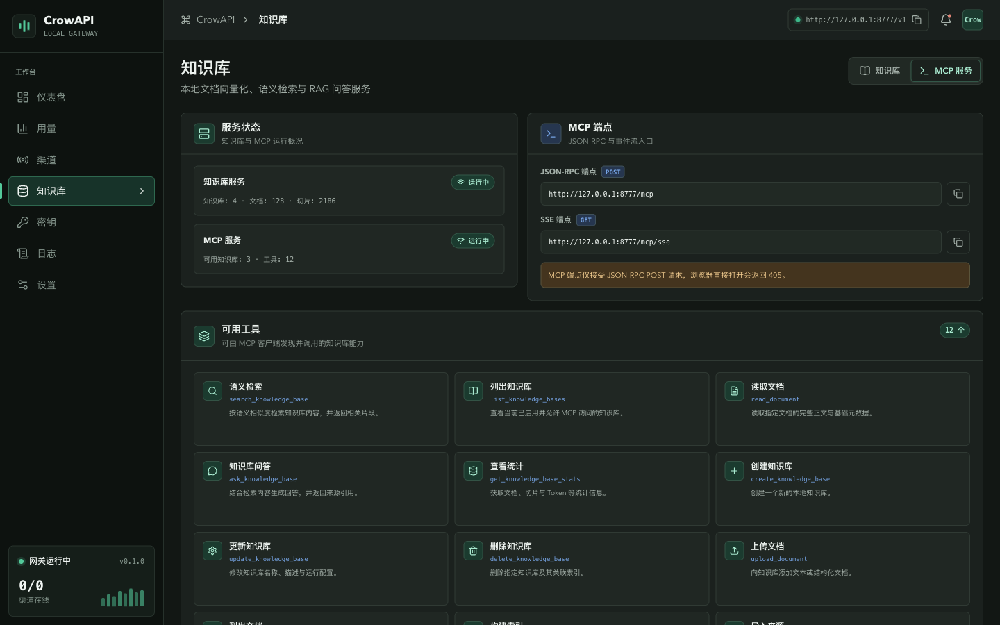
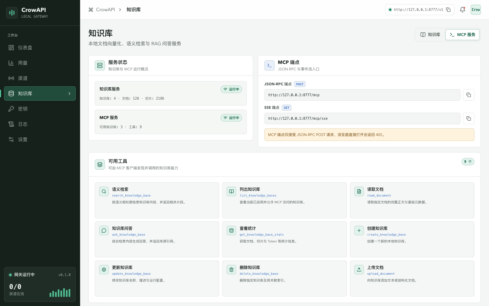
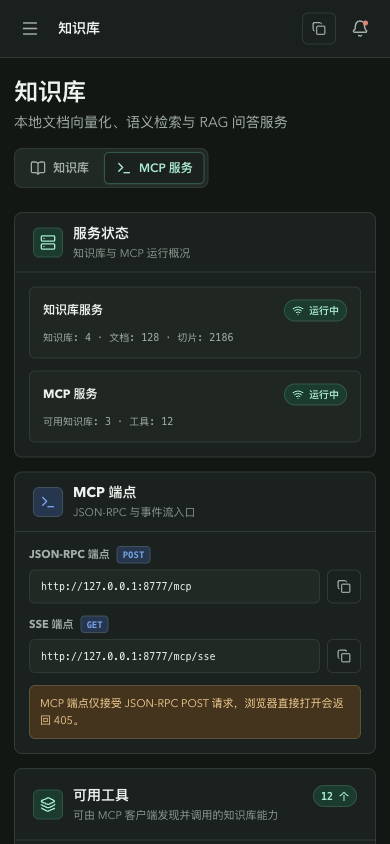

<div align="center">
  

  # CrowAPI

  **本地优先的 AI API 网关与知识服务桌面应用**

  在一个控制台中统一管理模型渠道、访问密钥、用量、请求日志、知识库与 Wiki 服务。

  
  
  
  
  
</div>



> 截图使用本地演示数据，仅用于展示界面。画面中不包含真实 API Key、请求正文、个人账号或本机文件路径。

## CrowAPI 是什么

CrowAPI 是一款基于 Tauri 的本地桌面应用。它在本机启动 AI API 网关，将不同上游模型渠道收敛为统一入口，同时提供访问控制、请求观测和本地知识服务。

项目默认监听 `127.0.0.1:8777`，业务数据保存在本地 SQLite 数据库中，适合个人开发、AI 工具接入、模型渠道调试和私有文档检索等场景。

## 核心能力

- **统一模型网关**：管理多个上游渠道、模型映射、优先级、启停状态与连接测试。
- **兼容常用协议**：提供 OpenAI Chat Completions、Completions、Responses、Embeddings、Models、Images、Audio，以及 Anthropic Messages 入口。
- **本地访问密钥**：创建、停用和删除 CrowAPI Key，并配置单 Key 配额与总量限制。
- **用量与日志**：查看请求量、Token、延迟、状态码和渠道分布，支持实时筛选与日志维护。
- **知识库与 RAG**：导入文档、生成切片与向量索引，进行语义检索和基于上下文的问答。
- **MCP 服务**：向兼容 MCP 的客户端暴露知识库检索、问答、读取和统计工具。
- **Wiki 工作区**：管理项目、页面、来源、标签、全文搜索和知识关系图。
- **安全与备份**：提供安全规则、敏感信息处理、本地配置导入导出与加密备份恢复。
- **桌面体验**：支持浅色/深色主题、系统托盘、开机启动和跨平台打包。

## 界面预览

<table>
  <tr>
    <td width="72%">
      
    </td>
    <td width="28%">
      
    </td>
  </tr>
  <tr>
    <td align="center">桌面端浅色主题</td>
    <td align="center">响应式窄屏布局</td>
  </tr>
</table>

## API 入口

默认基础地址：`http://127.0.0.1:8777`

| 能力 | 端点 |
| --- | --- |
| Chat Completions | `POST /v1/chat/completions` |
| Responses | `POST /v1/responses` |
| Embeddings | `POST /v1/embeddings` |
| Models | `GET /v1/models` |
| Image Generations | `POST /v1/images/generations` |
| Audio Transcriptions | `POST /v1/audio/transcriptions` |
| Audio Speech | `POST /v1/audio/speech` |
| Anthropic Messages | `POST /v1/messages` |
| Health Check | `GET /health` |

使用前请先在桌面端创建渠道和 CrowAPI Key。下面的值均为占位符：

```bash
curl "http://127.0.0.1:8777/v1/chat/completions" \
  -H "Authorization: Bearer <YOUR_CROWAPI_KEY>" \
  -H "Content-Type: application/json" \
  -d '{
    "model": "<MODEL_NAME>",
    "messages": [
      {"role": "user", "content": "Hello from CrowAPI"}
    ]
  }'
```

## 技术架构

```text
AI Client / Agent / MCP Client
                |
                v
        CrowAPI Local Gateway
        +-------------------+
        | Protocol Adapters |
        | Routing & Retry   |
        | Keys & Quotas     |
        | Security & Logs   |
        +-------------------+
          |             |
          v             v
  Upstream Models   Local Services
                    - SQLite
                    - Knowledge Base
                    - Vector Index
                    - Wiki / MCP
```

| 层级 | 技术 |
| --- | --- |
| 桌面容器 | Tauri 2 |
| 前端 | React 19、TypeScript、Vite 7、Tailwind CSS 4 |
| 本地服务 | Rust、Axum、Tokio、Reqwest |
| 数据存储 | SQLite、SQLx |
| 客户端状态 | TanStack Query、Zustand |
| 本地安全 | OS Keyring、Argon2、ChaCha20-Poly1305 |
| 知识处理 | HNSW 向量索引、PDF Extract、Tree-sitter |

## 本地开发

### 环境要求

- Node.js `20.19+` 或 `22.12+`
- Rust stable
- 对应平台的 [Tauri 2 系统依赖](https://v2.tauri.app/start/prerequisites/)

### 启动桌面应用

```bash
git clone <YOUR_REPOSITORY_URL>
cd crowapi
npm install
npm run tauri dev
```

CrowAPI 的页面通过 Tauri Command 读取本地数据库和服务状态。完整功能开发应使用 `npm run tauri dev`，单独运行 `npm run dev` 只会启动前端页面。

### 常用命令

```bash
npm run build          # TypeScript 检查并构建前端
npm test               # 运行 Vitest 测试
npm run tauri build    # 构建桌面安装包
npm run release:check  # 检查发布版本一致性
```

## 项目结构

```text
crowapi/
├── src/                       # React 控制台
│   ├── components/            # 布局与通用组件
│   ├── pages/                 # 仪表盘、渠道、密钥、日志、知识服务等页面
│   ├── lib/                   # Tauri Command API 与查询配置
│   └── types/                 # 前端类型定义
├── src-tauri/
│   ├── migrations/            # SQLite 数据库迁移
│   └── src/
│       ├── adaptor/           # 上游协议适配
│       ├── commands/          # 桌面端命令
│       ├── core/              # 网关核心能力
│       ├── server/            # Axum HTTP 服务
│       └── services/          # Knowledge Base、Wiki 与 MCP
├── docs/                      # 项目与发布文档
└── scripts/                   # 发布检查脚本
```

## 隐私与安全

- 默认仅监听本机环回地址，不主动暴露到公网。
- 渠道密钥由桌面端本地管理，敏感数据使用系统凭据存储与加密能力保护。
- 安全规则支持审计与拦截策略，可检查工具调用、网络目标、Unicode 混淆和响应内容。
- 请求日志与知识库内容保存在本机；公开问题、截图或日志前仍应主动检查并移除敏感内容。
- 如需局域网或公网访问，请自行配置鉴权、TLS、来源限制与防火墙规则，不建议直接暴露默认服务端口。

## 当前状态

CrowAPI 仍处于快速迭代阶段，接口、数据库迁移和界面可能继续调整。用于重要环境前，请先备份本地数据并在隔离环境验证升级流程。

欢迎通过 Issue 提交问题、使用场景和改进建议。
